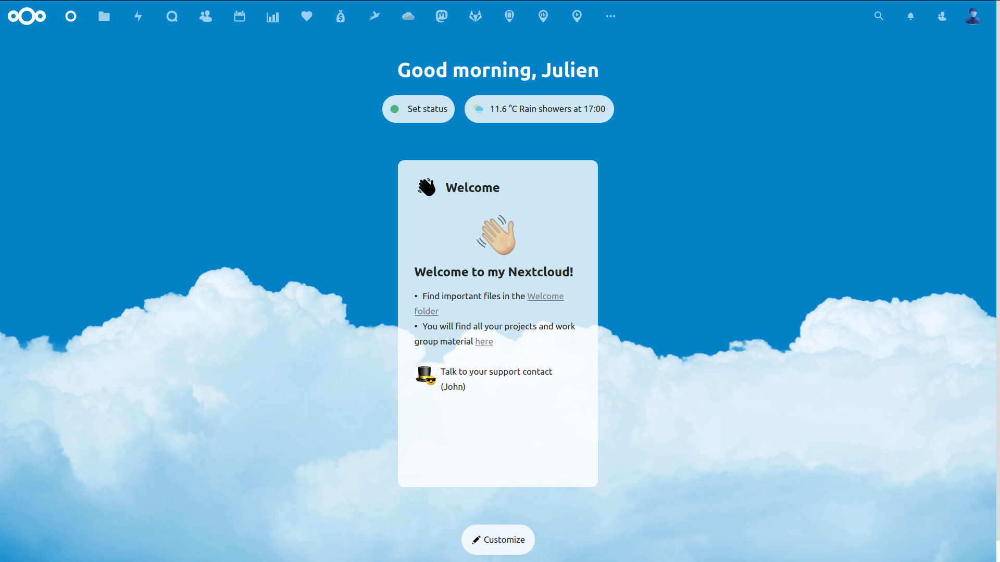

# Nextcloud welcome2 widget

ℹ A Markdown rendering Dashboard widget to welcome2 all users.

⚙ Configure via `Settings > Administration > Theming > Welcome2 widget`

📄 Pick a Markdown document to be rendered in the widget

💡 If no document is chosen, the widget won't be shown

📝 Edit the Markdown document to update the widget in real-time

🖼 Images are also supported

💬 Configure a contact person to directly start a chat with (requires [Nextcloud Talk](https://apps.nextcloud.com/apps/spreed) to be installed)

### Dashboard layout

Once the app is installed, if you want the Welcome2 widget to be displayed by default on new users dashboard, change the default dashboard layout:

```
occ config:app:set dashboard layout --value=welcome2,recommendations,spreed,mail,calendar
```

### Screenshot

